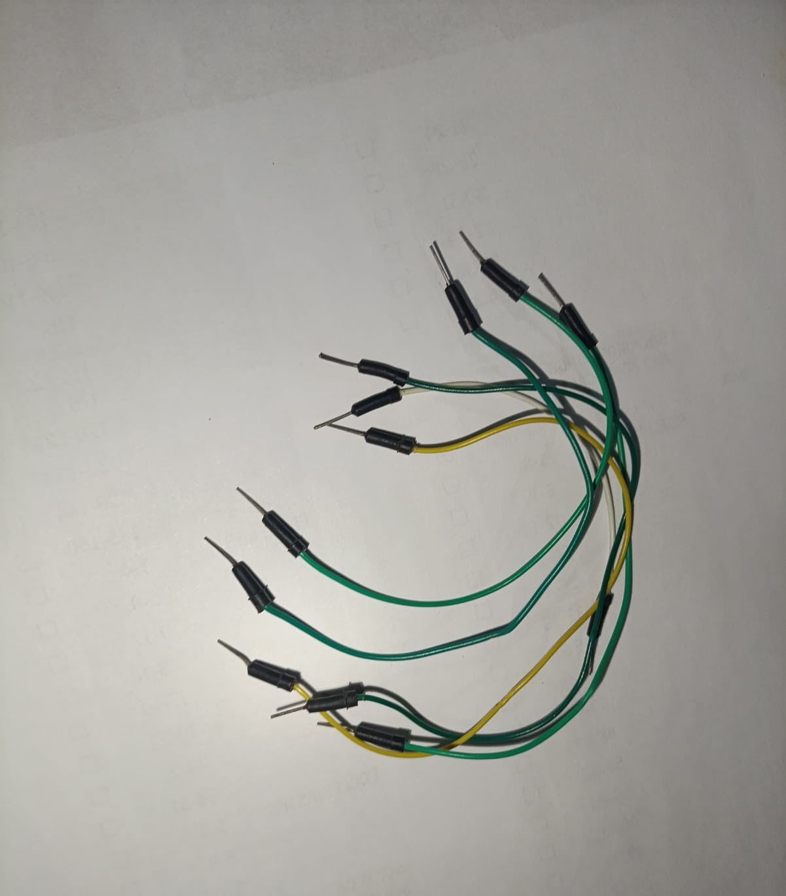

# 🖐️ Control de LEDs mediante Visión Artificial (Hand Tracking)

> **MakerLab - Universidad Cenfotec**
> Este proyecto es ideal para entender la integración entre el mundo físico (hardware) y la inteligencia artificial (software).


Este sistema permite controlar 5 LEDs físicos conectados a un Arduino utilizando gestos con la mano capturados a través de la cámara de una PC. Al levantar diferentes dedos frente a la cámara, el sistema enciende o apaga los LEDs correspondientes en tiempo real. 

---

## 🧠 Tecnologías y Conceptos Clave

En el mundo de la programación usamos "librerías", paquetes de código que resuelven problemas complejos. Para este proyecto, nos apoyamos en cuatro grandes pilares tecnológicos:

* **👁️ Visión por Computadora (OpenCV):** Los "Ojos". Abre la cámara web, captura el video cuadro por cuadro y transforma esas imágenes en datos legibles para Python.
* **🧠 Machine Learning (MediaPipe):** El "Cerebro" de Google. Entrenado con millones de imágenes, reconoce tu mano y dibuja un "esqueleto" digital, mapeando exactamente 21 puntos clave en milisegundos.
* **📐 Traductor Matemático (cvzone):** Simplifica la geometría compleja de MediaPipe. Con solo pedirle `fingersUp()`, calcula qué dedos están estirados basándose en la distancia de los puntos y nos devuelve un arreglo de 1s y 0s.
* **🌉 Comunicación Serial (Firmata & PyFirmata2):** El "Puente". Arduino y Python hablan idiomas distintos. *Firmata* convierte al Arduino en un hardware obediente, y *pyfirmata2* le permite a Python enviar órdenes eléctricas directas por el cable USB (ej. *"¡Enciende el pin 8!"*).

---

## 🛠️ Materiales Necesarios

| Cantidad | Componente | Notas |
| :---: | :--- | :--- |
| 1 | Placa Arduino | Uno, Mega, Nano, etc. |
| 1 | Protoboard | Placa de pruebas para los circuitos. |
| 5 | LEDs | Cualquier color. |
| 5 | Resistencias | 220 ohmios. |
| Varios | Cables Jumper | Macho-Macho. |
| 1 | Cámara Web | Integrada en la PC o externa. |

---

## 🔌 Conexiones de Hardware

Sigue estos pasos para armar tu circuito. Recuerda que siempre debes usar una resistencia en serie con cada LED para limitar la corriente y no quemarlo.

1. Conecta el pin **GND** del Arduino a la línea negativa de la protoboard.
2. Coloca los 5 LEDs en la protoboard. 
3. Conecta una resistencia de **220 ohmios** desde el **cátodo** (pata corta o negativa) de cada LED hacia la línea negativa de la protoboard.
4. Conecta el **ánodo** (pata larga o positiva) de cada LED directamente a los pines digitales del Arduino usando cables jumper de la siguiente manera:

| Dedo de la Mano | Pin del Arduino |
| :--- | :---: |
| Pulgar | **Pin 8** |
| Índice | **Pin 9** |
| Medio | **Pin 10** |
| Anular | **Pin 11** |
| Meñique | **Pin 12** |

---
### Galería de Componentes

**Protoboard y Arduino UNO**


**LEDs y Resistencias**


**Jumpers**


**Circuito Final**


## 💻 Configuración del Software

### 1. Preparación del Arduino (Firmata)
Antes de correr el código en Python, el Arduino debe estar listo para recibir órdenes:
1. Conecta el Arduino a la PC y abre el **Arduino IDE**.
2. Ve a `Archivo` > `Ejemplos` > `Firmata` > `StandardFirmata`.
3. Selecciona tu placa, el puerto correspondiente y haz clic en **Subir**.

### 2. Instalación de Python 3.11
Para evitar errores de compatibilidad con las librerías de visión, utilizaremos **Python 3.11**:
1. Descárgalo desde [python.org](https://www.python.org/downloads/release/python-3110/).
2. **⚠️ MUY IMPORTANTE:** Al instalar, marca la casilla **"Add Python 3.11 to PATH"**.

### 3. Descarga del Proyecto
1. Ve al inicio de este repositorio en GitHub.
2. Haz clic en el botón verde **"Code"** y selecciona **"Download ZIP"**.
3. Descomprime el archivo en tu computadora.

### 4. Instalación de Librerías
Abre una terminal (CMD o PowerShell) en la carpeta principal del proyecto y ejecuta:
```bash
pip install opencv-python cvzone mediapipe pyfirmata2
```

⚙️ Configuración y Ejecución
Configurar el Puerto COM
Si el programa se cierra solo al intentarlo abrir, es probable que Python no encuentre el Arduino.

Abre el archivo codigos/controller.py.

Busca la línea que dice comport = 'COM9'.

Cambia 'COM9' por el número de puerto exacto que te mostró el Arduino IDE (ej. 'COM3').

# ¡Correr el Programa!
Para asegurarnos de que el sistema utiliza la versión correcta de Python, abre tu terminal en la carpeta principal 01-Cotrol-LED-Vision-Artificial y ejecuta en el cmd o en powershell:

```bash
py -3.11 códigos/hand_tracker.py
```
🎉        ╰(*°▽°*)╯         🎉


# Más sobre las Tecnologías (Librerías) que hacen esto posible
En el mundo de la programación, no necesitamos inventar la rueda cada vez. Usamos "librerías": paquetes de código que otras personas o empresas muy brillantes ya resolvieron y comparten gratuitamente. Para este proyecto, estamos parados sobre los hombros de cuatro "gigantes tecnológicos":

**1. OpenCV (opencv-python):** Los "Ojos" del proyecto
¿Qué es? Es la librería de Visión por Computadora (Computer Vision) más famosa y utilizada en el mundo.

¿Qué hace en nuestro código? Se encarga de la parte física de la imagen. Abre la cámara web de tu PC, captura el video cuadro por cuadro (como si tomara 30 fotos por segundo) y transforma esas imágenes en datos que Python puede leer.

**2. MediaPipe:** El "Cerebro" entrenado por Google
¿Qué es? Es una tecnología de Inteligencia Artificial (específicamente Machine Learning) desarrollada por Google.

¿Qué hace en nuestro código? Los ingenieros de Google le mostraron a este programa millones de fotos de manos humanas hasta que "aprendió" a reconocerlas perfectamente. MediaPipe mira las imágenes que le pasa OpenCV y es capaz de dibujar un "esqueleto" digital sobre tu mano real, mapeando exactamente 21 puntos clave (las yemas de tus dedos, tus nudillos y tu muñeca) en milisegundos.

**3. CVZone (cvzone):** El "Traductor" de matemáticas
¿Qué es? Es una herramienta diseñada para hacer que librerías complejas (como OpenCV y MediaPipe) sean súper fáciles de usar para principiantes y makers.

¿Qué hace en nuestro código? Aunque MediaPipe sabe dónde están los 21 puntos de tu mano, calcular matemáticamente si un dedo está estirado o doblado requiere mucha geometría. cvzone hace toda esa matemática pesada por detrás y nos regala una instrucción súper sencilla: con solo pedirle fingersUp(), el código nos responde con un arreglo de 1s y 0s indicando exactamente qué dedos tienes levantados.

**4. PyFirmata2 y el protocolo Firmata:** El "Puente" de comunicación
¿Qué es? Firmata es un idioma universal (protocolo) para microcontroladores, y pyfirmata2 es el diccionario que le enseña a Python a hablar ese idioma.

¿Qué hace en nuestro código? Normalmente, el "cerebro" de la computadora (Python) y el "músculo" físico (Arduino) no se entienden porque hablan lenguajes distintos. Al instalar Firmata en el Arduino, este se convierte en un hardware obediente que solo escucha. Luego, pyfirmata2 le permite a nuestro código Python enviar órdenes eléctricas directas por el cable USB: "¡Oye pin 8, enciende ese LED ahora mismo!".
