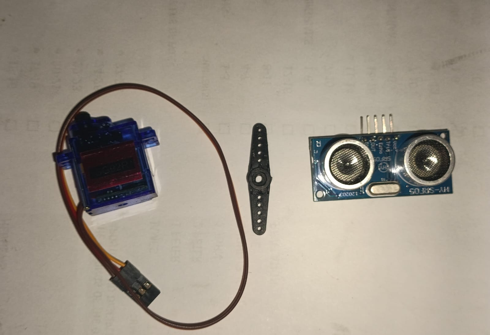
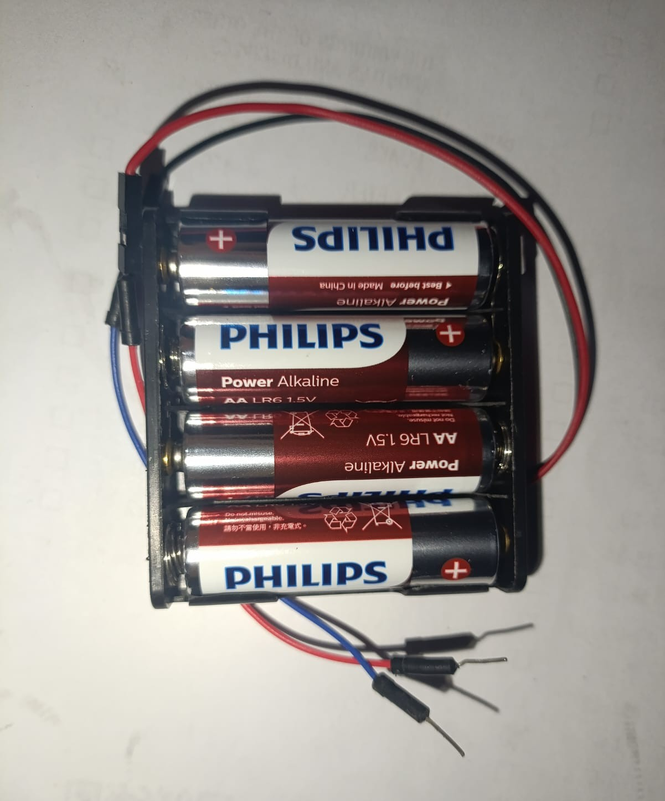
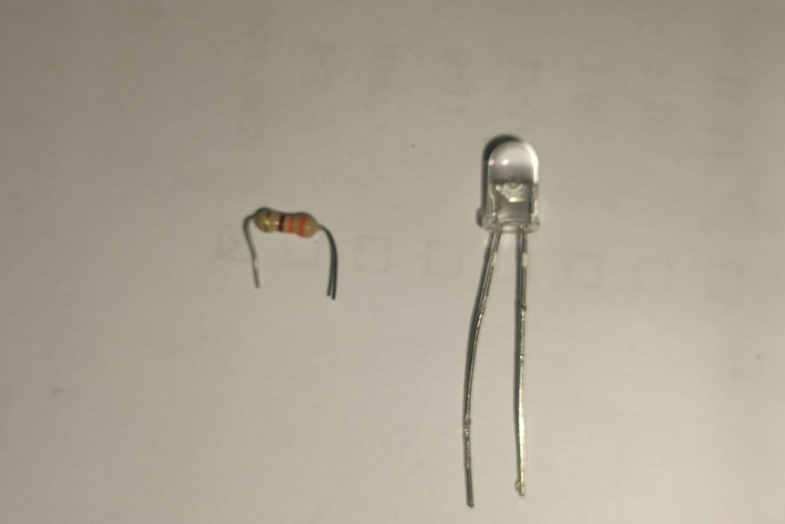
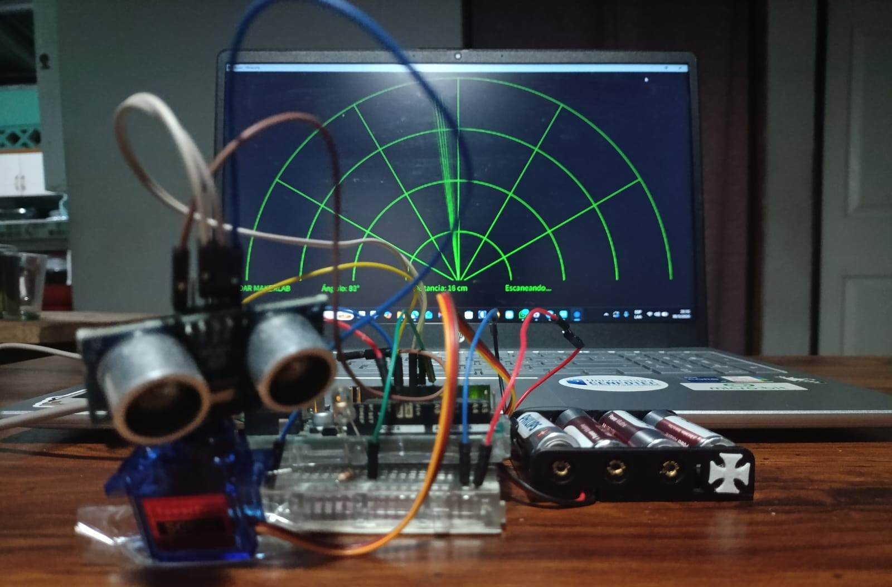

# 🛰️ Radar Ultrasónico Interactivo (Visualización 2D)

> **MakerLab - Universidad Cenfotec**
> Este proyecto es una introducción perfecta al mundo de la **percepción robótica** y la **sincronización hardware-software**, recreando cómo las máquinas "ven" su entorno.

Este sistema simula un radar militar real. Un sensor de ultrasonido montado sobre un servomotor realiza un barrido continuo de 180°. Mientras el hardware mide distancias, una interfaz gráfica en **Processing** dibuja el radar en tiempo real. Si un objeto entra en el rango de detección, el sistema reacciona de forma multimodal: el radar digital cambia a color rojo, se enciende un LED físico y suena una alarma sonora desde los altavoces de la computadora.

---

## 🧠 Tecnologías y Conceptos Clave

Para que este radar funcione, conectamos el mundo físico con el digital usando estos cuatro pilares:

* **🦇 Sensor Ultrasónico (Los Ojos):** Funciona como el sonar de un murciélago. Envía pulsos de sonido inaudibles y mide cuánto tardan en rebotar para calcular la distancia de los objetos.
* **🦾 Servo Motor (El Cuello):** Es un motor de precisión que nos permite rotar el sensor grado por grado para cubrir un área de visión completa de 180°.
* **🌉 Comunicación Serial (El Puente):** El cable USB transporta ráfagas de datos constantemente. Arduino le dice a la PC: *"Estoy en el grado 45 y veo algo a 10cm"*, y la PC lo dibuja al instante.
* **🎨 Processing (La Pantalla del Radar):** Es un lenguaje de programación visual. Toma los datos crudos de Arduino y los transforma en una interfaz estética, similar a la de un submarino o una torre de control.

---

## 🛠️ Materiales Necesarios

| Cantidad | Componente | Notas |
| :---: | :--- | :--- |
| 1 | Arduino UNO | El cerebro que coordina los sensores. |
| 1 | Sensor HC-SR04 | El sensor de ultrasonido. |
| 1 | Servo SG90 | Motor de rotación de 180°. |
| 1 | LED | Indicador visual de alerta física. |
| 1 | Resistencia 220Ω | Para proteger el LED. |
| 1 | Protoboard | Placa de pruebas para los circuitos. |
| 1 | Caja de Baterías 4xAA | **Fuente externa necesaria** para el motor. |
| Varios | Cables Jumper | Macho-Macho para las interconexiones. |

---

## 🔌 Conexiones de Hardware (MUY IMPORTANTE)

Armar este circuito requiere atención especial a la **distribución de energía**. Los servomotores son como "músculos" y consumen demasiada corriente. Si intentas alimentarlo directamente del Arduino, provocarás reinicios en la placa.

**Solución aplicada:** Añadimos una fuente externa (Caja de 4 baterías AA) exclusivamente para darle potencia al circuito.

### 1. Distribución de Energía y Regla de Oro
* **Arduino 5V** ➡️ Línea positiva (+) de la protoboard.
* **Arduino GND** ➡️ Línea negativa (-) de la protoboard.
* **Caja de Baterías 4xAA** ➡️ Conectar sus cables a las líneas (+) y (-) de la protoboard.
* **⚠️ REGLA DE ORO MAKER:** ¡TODOS LOS GND DEBEN ESTAR CONECTADOS EN COMÚN! El GND del Arduino, el GND de las baterías y el GND de los componentes deben compartir la misma línea negativa de la protoboard para que las señales eléctricas se entiendan.

### 2. Conexiones por Componente

| Componente | Pin / Cable | Conexión en Protoboard / Arduino |
| :--- | :--- | :--- |
| **LED de Alerta** | Patita Corta (Cátodo) | A la resistencia de 220Ω, y de ahí a la línea negativa (-). |
| | Patita Larga (Ánodo) | Directo al **Pin 7** del Arduino. |
| **Sensor Ultrasónico**| VCC | Línea positiva (+). |
| | GND | Línea negativa (-). |
| | TRIG | Directo al **Pin 8** del Arduino. |
| | ECHO | Directo al **Pin 9** del Arduino. |
| **Servo Motor** | Rojo (VCC) | Línea positiva (+). |
| | Negro/Marrón (GND)| Línea negativa (-). |
| | Naranja (Señal) | Directo al **Pin 11** del Arduino. |

---

## 🖼️ Galería de Componentes

Para replicar este proyecto, asegúrate de que tu montaje luzca como en estas referencias:

**Protoboard y Arduino UNO**

**Servomotor y sensor ultrasónico**

**Baterías**

**LED y Resistencia**

**Jumpers**

**Resultado**

---

## 💻 Configuración del Software

### 1. Preparación del Arduino
El código responsable de mover el motor y medir las distancias se encuentra en la carpeta `codigos/`.
1. Conecta el Arduino a la PC y abre el **Arduino IDE**.
2. Abre el archivo `codigos/radar_arduino/radar_arduino.ino`.
3. Selecciona tu placa, el puerto COM correspondiente y haz clic en **Subir**.

### 2. Configuración de Processing
Para visualizar el radar en tu pantalla, necesitamos preparar el entorno visual:
1. Descarga e instala [Processing](https://processing.org/).
2. **Instalar Librerías:** En Processing, ve a `Sketch` > `Import Library` > `Add Library...` y busca:
   * **Serial** (para la comunicación con Arduino).
   * **Sound** (para activar la alarma auditiva).
3. **Carpeta de Sonido:** Localiza el archivo `alarm-sfx-sound.wav`. Debes crear una carpeta llamada `data` dentro de la carpeta `codigos/radar_visualizer/` y pegar el archivo de audio ahí adentro.
4. **⚠️ Configurar el Puerto COM:** Abre el archivo `codigos/radar_visualizer/radar_visualizer.pde`. Busca la línea `myPort = new Serial(this,"COM9",9600);` y cambia `"COM9"` por el número de puerto exacto que te mostró el Arduino IDE (ej. `"COM3"`).

---

## 🚀 Ejecución

1. Asegúrate de que las baterías externas estén encendidas o conectadas al circuito.
2. Abre tu código `radar_visualizer.pde` en Processing.
3. Haz clic en el botón **Play** (el triángulo arriba a la izquierda).
4. Pon tu mano o un objeto frente al radar y observa cómo cambia el ecosistema visual, el LED y el sonido de alerta. 🎉

# ¡LISTO!
🎉        ╰(*°▽°*)╯         🎉

---

## 🔬 Más sobre las Tecnologías (Aprendizaje Maker)

En el MakerLab, no solo armamos piezas; entendemos los problemas reales del prototipado:

**1. El reto de la alimentación eléctrica:**
Muchos principiantes creen que con los 5V del USB es suficiente. Sin embargo, el servo motor requiere picos de **corriente (amperios)** que el Arduino no puede dar solo. Al usar baterías externas, aprendemos a separar la potencia (motor) de la lógica (microcontrolador).

**2. Sincronización de Tiempos:**
El código debe estar perfectamente balanceado. Si el servo gira demasiado rápido, el sensor de ultrasonido no tiene tiempo de recibir el "eco" y las mediciones darán error. Este proyecto enseña a manejar los tiempos de respuesta del hardware.

**3. Debugging Físico vs Digital:**
Si el radar no se mueve en la pantalla, aprendemos a usar el **Monitor Serie**. Si los números aparecen ahí, sabemos que el problema no es el cable ni el Arduino, sino el código de Processing. Dividir el problema en partes es la base de la ingeniería.

---
