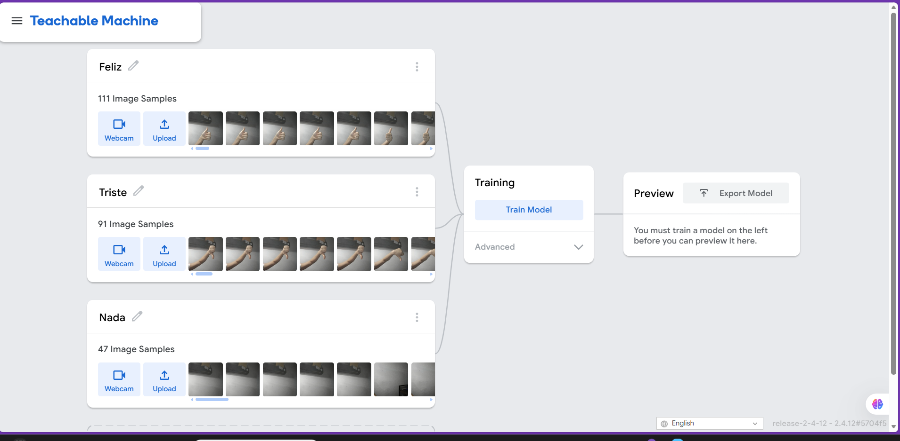
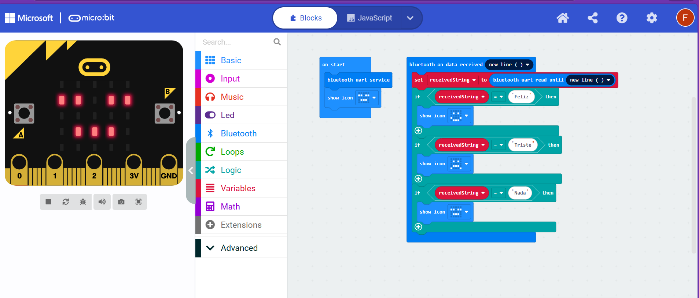
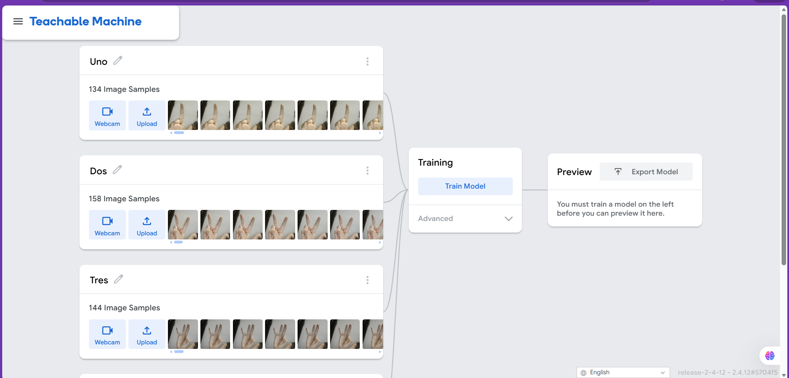
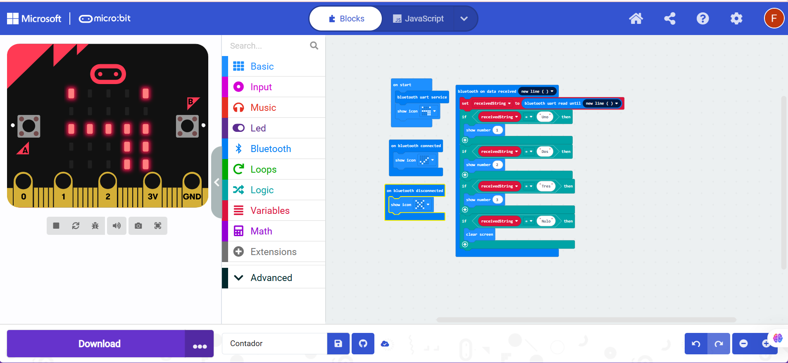
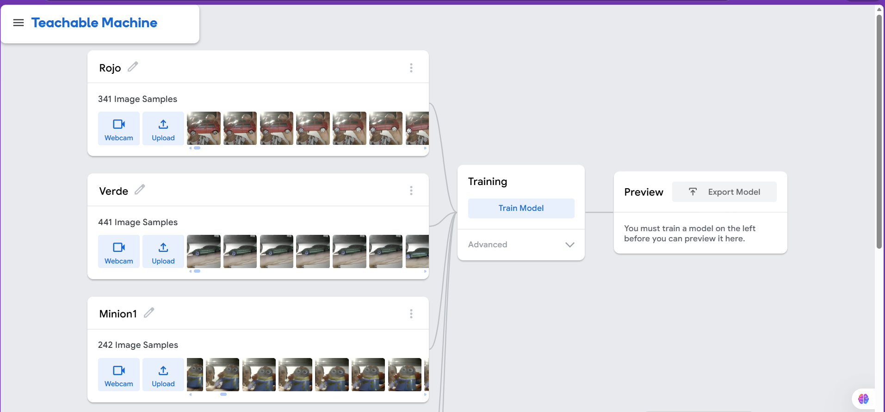
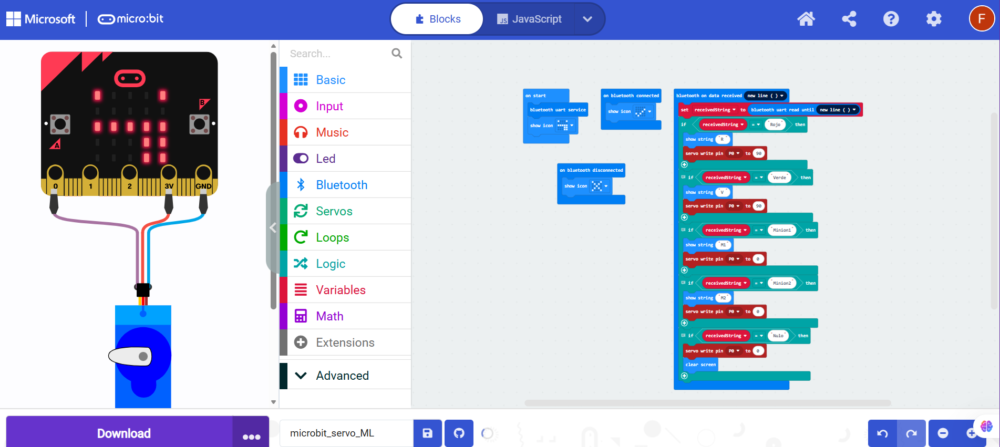
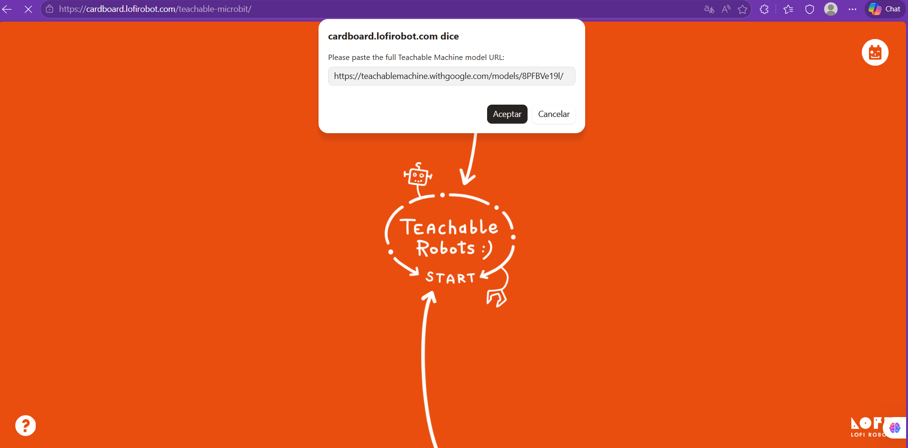
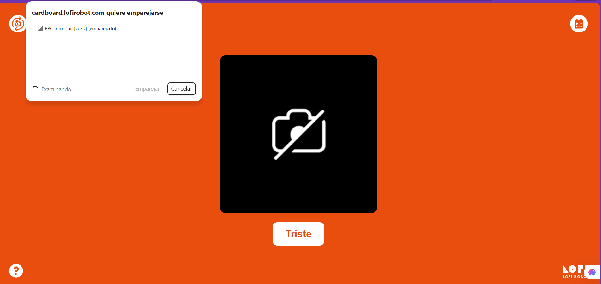

# 🤖 05-Microbit_MachineLearning: Conectando la IA al Mundo Físico

MakerLab - Universidad Cenfotec. Este proyecto está diseñado para introducir a los estudiantes en la integración de la **Inteligencia Artificial (Machine Learning)** con el hardware físico. 

El objetivo general es demostrar cómo una computadora puede "aprender a ver" el mundo real y tomar decisiones que hagan reaccionar a un microcontrolador al instante. A través de este flujo, podemos lograr que un sistema clasifique gestos, reconozca objetos o controle accesos de seguridad, todo mediante la visión de una cámara web.

> 📢 **Aclaración Importante del Ecosistema Maker:**
> En el MakerLab creemos en aprovechar las mejores herramientas disponibles. Este proyecto se apoya en plataformas externas que **no** son desarrolladas por Cenfotec, pero son vitales en la comunidad educativa global para demostrar estos conceptos:
> * **Teachable Machine & MakeCode:** Herramientas gratuitas de Google y Microsoft, respectivamente.
> * **Lofirobot Teachable Microbit:** Una increíble aplicación web independiente creada por un desarrollador de la comunidad Maker que funciona como puente mágico entre la IA y la placa.

---

## 🧠 Tecnologías y Conceptos Clave

Antes de ver los ejemplos prácticos, entendamos las piezas del rompecabezas:

* 🧠 **El Cerebro Digital (Teachable Machine):** Aquí entrenamos el modelo de IA. Mediante *Aprendizaje Supervisado*, le mostramos a la computadora muchas fotos etiquetadas (ej. "Rojo", "Verde") para que encuentre patrones matemáticos y aprenda a diferenciarlos.
* 🦾 **El Cuerpo Físico (BBC Micro:bit):** Es nuestro microcontrolador. Él no sabe de IA, solo obedece órdenes. Ejecutará acciones físicas (mostrar caras, encender luces o mover motores) basándose en lo que la computadora le diga.
* 🌐 **El Sistema Nervioso (Lofirobot Bridge):** Es la página web que conecta la cámara de tu PC o teléfono con la antena de la placa.
* 📡 **El Idioma (Bluetooth UART):** El protocolo de comunicación. Lofirobot le "susurra" inalámbricamente mensajes de texto cortos al Micro:bit (ej. "Feliz", "Abrir") para que sepa cómo actuar.

### 💡 El Secreto de una buena IA: La Calidad de los Datos
Es vital entender que **el rendimiento del modelo depende 100% de la calidad de las imágenes con las que se entrene**. Un modelo de IA no es "mágico"; si le das datos pobres, tomará decisiones pobres. Para que tu proyecto funcione perfectamente, sigue estas reglas al capturar tus fotos:
* **Variedad:** Captura el objeto desde diferentes ángulos, distancias y posiciones.
* **Iluminación:** Asegúrate de que haya buena luz. Las sombras fuertes confunden a la IA.
* **Fondos distintos:** Si siempre entrenas con la misma pared de fondo, la IA podría creer que la pared es parte del objeto. ¡Mueve la cámara!
* **Clase "Vacia/Nada":** Siempre crea una clase donde no haya nada frente a la cámara, para que el sistema sepa cuándo debe estar en reposo.

---

## 🧪 Nuestros 3 Ejemplos Prácticos

A continuación, explicamos los tres laboratorios que ya tenemos preparados.

### Ejemplo 1: Detector de Emociones y Gestos 🎭
Este fue nuestro primer acercamiento. El sistema detecta qué estás haciendo con tus manos o tu rostro y el Micro:bit refleja esa "energía" en su pantalla.

* **1. Entrenamiento del Modelo:** Creamos tres clases en Teachable Machine: `Feliz` (sonriendo o pulgar arriba), `Triste` (pulgar abajo) y `Nada` (cámara vacía o rostro neutral). Capturamos unas 100 fotos variadas por clase.
  

* **2. Programación (MakeCode):** Usamos el bloque `on bluetooth data received`. Añadimos condiciones lógicas: si recibe la palabra "Feliz", la matriz LED muestra `IconNames.HAPPY`; si recibe "Triste", muestra `IconNames.SAD`; si recibe "Nada", limpia la pantalla o muestra `IconNames.ASLEEP`.
  

* **3. Funcionamiento:** Al ejecutar, la web clasifica el gesto en tiempo real y el Micro:bit cambia su cara al instante, sin necesidad de cables.
  
  

---

### Ejemplo 2: Contador Visual de Dedos ✌️
Este experimento demuestra cómo la IA puede cuantificar elementos en pantalla y enviar datos numéricos.

* **1. Entrenamiento del Modelo:** Entrenamos cuatro clases: `Uno`, `Dos`, `Tres` y `Nulo`. Fue crucial mover la mano por toda la pantalla durante la captura para que la IA aprendiera a contar los dedos sin importar en qué parte del cuadro estuvieran.
  

* **2. Programación (MakeCode):** Evaluamos el texto recibido. Si es "Uno", dibujamos el número 1 usando el bloque `show number 1`. Repetimos la lógica para los demás números, y apagamos los LEDs si recibe "Nulo".
  

* **3. Funcionamiento:** La placa actúa como un display digital inteligente que se actualiza según la cantidad de dedos que detecta la cámara de tu computadora.
  

---

### Ejemplo 3: Portón de Seguridad Automatizado (Servo) 🚧
¡Llevamos la IA al mundo mecánico! Aquí combinamos reconocimiento de colores u objetos con control de actuadores para simular domótica (Smart Home).

* **1. Entrenamiento del Modelo:** Entrenamos clases como `Verde` (para carros autorizados) y `Rojo` (para no autorizados). También agregamos objetos específicos como `Minion1` y `Minion2` en clases separadas para bloquear su ingreso.
  

* **2. Programación (MakeCode):** Configuramos el control del Servomotor. Si el Bluetooth recibe "Verde", usamos el bloque `servo write pin P0 to 90` para abrir la barrera. Si recibe "Rojo" o "Minion1", escribimos `0` grados para cerrarla.
  

* **3. Funcionamiento:** Al colocar el carro verde frente a la cámara, la IA lo autoriza, envía la orden y el motor físico levanta la barrera permitiendo el paso.
  

---

## 🛠️ Materiales Necesarios

| Cantidad | Componente | Función |
| :--- | :--- | :--- |
| 1 | BBC Micro:bit (V1 o V2) | Microcontrolador principal con matriz LED y BLE. |
| 1 | Computadora con Webcam | Para entrenar la IA y ejecutar el modelo en la web. |
| 1 | Cable Micro-USB | Para cargar el programa base en el Micro:bit. |
| 1 | Servo Motor SG90 (Opcional) | Actuador para abrir un acceso/portón (Ejemplo 3). |
| 3 | Cables Jumper | Para realizar las conexiones del servo (Ejemplo 3). |

---

## 🔌 Conexiones de Hardware (Ejemplo 3)

⚠️ **REGLA DE ORO MAKER:** Si vas a usar el motor para el Ejemplo 3, conecta todo como se indica en la siguiente tabla antes de encender el sistema. Un micro-servo SG90 puede funcionar directamente desde los pines de la placa para un prototipo rápido.

| Cable del Servo | Conexión Física en Micro:bit |
| :--- | :--- |
| Rojo (VCC) | Pin **3V** |
| Negro / Marrón (GND) | Pin **GND** |
| Amarillo / Naranja (Señal) | Pin **P0** |

---

## 🚀 Cómo replicar estos laboratorios

Para facilitar tu aprendizaje, hemos dejado listos los modelos de IA y los códigos de programación. Sigue estos pasos:

### Paso 1: Cargar el código al Micro:bit
1.  Ve a la carpeta 📁 [codigos](https://github.com/Aggy2025/makerlab-mini-proyectos/tree/main/05-Microbit_MachineLearning/codigos) en este repositorio y descarga el archivo `.hex` del ejemplo que quieras probar.
2.  Conecta tu Micro:bit a la computadora por USB. Aparecerá como si fuera una llave maya.
3.  Arrastra el archivo descargado directamente a la unidad del Micro:bit. La placa parpadeará y se reiniciará con el código cargado.

### Paso 2: Conectar el Puente y los Modelos
1.  Abre la carpeta 📁 [modelos](https://github.com/Aggy2025/makerlab-mini-proyectos/blob/main/05-Microbit_MachineLearning/modelos/modelos.md) de este proyecto. Allí encontrarás archivos de texto con los enlaces pre-entrenados para cada uno de los 3 ejemplos. Copia el enlace que deseas usar.
2.  Entra a la herramienta web: 🔗 [Lofirobot Teachable Microbit](https://cardboard.lofirobot.com/teachable-microbit/).
3.  Pega el enlace de tu modelo en la casilla de la página web.
4.  
 

6.  Presiona **Connect Micro:bit**, selecciona tu placa en la lista de Bluetooth (recuerda tener activa la configuración de "No Pairing Required" en MakeCode) y ¡listo! Pon a prueba la inteligencia del sistema frente a la cámara.

 
---

## 🏗️ Crea tu propio proyecto (Guía Paso a Paso)

¡No te limites a nuestros ejemplos! Construye tu propio sistema inteligente siguiendo nuestra metodología:

### 1. Entrenar a la IA (El Cerebro)
1. Ingresa a [Teachable Machine](https://teachablemachine.withgoogle.com/) y selecciona **Proyecto de Imagen** -> **Modelo de imagen estándar**.
2. Cambia el nombre de las "Clases" (ej. "Perro", "Gato", "Vacio"). **¡Anota estos nombres exactamente como los escribiste (respetando mayúsculas) ya que los usarás en tu código!**
3. Usa la **Webcam** para capturar unas 100 imágenes variadas por clase (recuerda los consejos de calidad de datos).
4. Haz clic en **Entrenar Modelo** y pruébalo en la vista previa.
5. Presiona **Exportar el modelo**, selecciona la pestaña **Subir (Upload)**, sube tu modelo y **copia el enlace (URL)**.

### 2. Programar la Placa (El Cuerpo)
1. Entra a [MakeCode Micro:bit](https://makecode.microbit.org/) y crea un Nuevo Proyecto.
2. Ve a las extensiones y busca **Bluetooth**.
3. Haz clic en el engranaje ⚙️ -> **Configuración del proyecto** y selecciona **"No Pairing Required: Anyone can connect via Bluetooth"**. ¡Esto es vital para que la web detecte tu placa!
4. En el bloque `al iniciar`, agrega `bluetooth start uart service`.
5. Usa el evento `on bluetooth uart data received` (configurado en `until new line`) para leer los mensajes que llegan.
6. Crea condiciones lógicas (`if/else`). **Si el texto recibido es igual a "Perro"**, pon los bloques que definan qué hará el Micro:bit (ej. mostrar una cara feliz).
7. Descarga el código y pásalo a tu Micro:bit.

### 3. Conectar y Ejecutar (El Puente)
1. Con tu Micro:bit encendido por batería o USB, abre [Lofirobot](https://cardboard.lofirobot.com/teachable-microbit/).
2. Pega la URL de tu modelo de Teachable Machine.
3. Presiona **Connect Micro:bit**, selecciona tu placa y ¡listo! Revisa cómo tu hardware obedece a tu propia Inteligencia Artificial.

---

## 📂 ¿Qué contiene esta carpeta?

* 📄 `README.md`: Este documento con la documentación completa.
* 📁 `codigos/`: Los archivos de programación de MakeCode (Emociones, Conteo y Servo) listos para la placa.
* 📁 `modelos/`: Enlaces URL de Teachable Machine con los entrenamientos pre-configurados.
* 📁 `imagenes/`: Fotografías del montaje, capturas de pantalla de código y demostraciones.

---

## 🔬 Futuras Pruebas y Mejoras (¡Tu turno!)

El MakerLab es un espacio para experimentar. Te invitamos a intentar lo siguiente usando **únicamente** la pantalla de tu Micro:bit:

1.  **Monitor de Postura Inteligente 🧘:** Entrena un modelo que detecte "Espalda Recta" y "Espalda Encorvada". Programa el Micro:bit para que, si te encorvas, parpadee una gran "X" en su pantalla LED, recordándote que debes sentarte bien.
2.  **Juego de "Piedra, Papel o Tijeras" contra la IA ✌️:** Combina IA con lógica de videojuegos. Entrena a la computadora para reconocer las tres señas. Luego, programa que el Micro:bit elija su propia jugada al azar, la compare con la tuya y muestre una "W" (Ganaste) o "L" (Perdiste).
3.  **Mascota Virtual (Estilo Tamagotchi) 🐾:** Entrena la cámara para reconocer dibujos en papel (ej. una manzana, una gota de agua). Cuando le muestres la manzana, el Micro:bit mostrará una animación de "masticar" en sus LEDs.

*Si tienes alguna idea increíble o mejoras los códigos, ¡no dudes en crear un Pull Request en este repositorio!*
